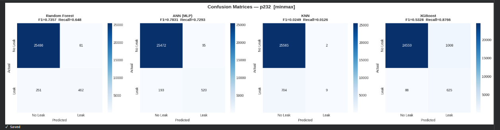

# AI-Driven Sewer Blockage Detection Framework

**Deakin University — SEJ441 Engineering Project A**  
**Industry Partner:** Barwon Water  
**Author:** Shawn Akilesh Jeyaprakash  
**Supervisor:** Dr. Dylan Mo  

---

## Project Overview

This project develops an **AI-driven adaptive anomaly detection framework** for sewer blockage detection in smart water networks. The framework is designed to operate on multivariate time-series IoT sensor data — without requiring labelled fault examples — making it directly applicable to real-world operational infrastructure.

The work addresses a core challenge for utilities like Barwon Water: sewer blockages develop gradually, but conventional monitoring relies on fixed thresholds and reactive maintenance. This project uses machine learning to detect anomalous sensor behaviour before a blockage causes a sanitary sewer overflow (SSO).

---

## Problem Statement

- Sewer blockages form through FOG accumulation, root intrusion, and pipe deterioration
- Fixed-threshold alerts cannot adapt to seasonal variation and sensor drift
- Most operational sewer data is **unlabelled** — supervised approaches alone are insufficient
- Early detection creates an intervention window before overflow events occur

---

## Approach

The project follows a two-phase methodology:

**Phase 1 — Supervised Baseline (BattleDIM benchmark dataset)**
- Establish pipeline with labelled data: preprocessing, feature engineering, model training, SHAP explainability
- Benchmark against BattleDIM competition results (Vrachimis et al., 2022)

**Phase 2 — Unsupervised Anomaly Detection (Barwon Water operational data)**
- Adapt pipeline to unlabelled real-world sewer telemetry
- Apply Isolation Forest, LSTM Autoencoder, and SALDA-inspired adaptive thresholding

---

## Pipeline Architecture

```
Raw Sensor Data (SCADA / IoT)
        │
        ▼
Data Ingestion & Merging
        │
        ▼
Temporal Resampling (5-min → 15-min)
        │
        ▼
Missing Value Handling (forward-fill)
        │
        ▼
Train / Test Split (stratified or temporal)
        │
        ▼
Feature Engineering
  ├── Rolling Mean
  ├── Rolling Std Dev
  ├── Rate of Change
  └── Rolling Z-score
        │
        ▼
Scaling (MinMaxScaler vs StandardScaler)
        │
        ▼
Feature Selection
  ├── Variance Threshold
  ├── Correlation Filtering
  ├── Mutual Information
  └── RF Importance
        │
        ├──────────────────────────┐
        ▼                          ▼
Supervised Models          Unsupervised Models
  ├── Random Forest           ├── Isolation Forest
  ├── ANN (MLP)               ├── LSTM Autoencoder
  ├── XGBoost                 └── SALDA (T2)
  └── KNN
        │                          │
        └──────────┬───────────────┘
                   ▼
        SHAP Explainability Analysis
                   │
                   ▼
        Evaluation (Precision / Recall / F1)
```

---

## Dataset

**BattleDIM (L-Town benchmark)** — Vrachimis et al. (2022)
- 33 pressure sensors, 3 flow sensors, 82 AMR demand readings
- 2 years of simulated SCADA time-series at 5-minute resolution
- Resampled to 15-minute intervals to match Barwon Water telemetry
- Target pipe: p232

**Barwon Water Operational Data** *(not included — proprietary)*
- Lorne node (GID 1009234): labelled, 3 confirmed partial blockage events
- Highton node (GID 38777): unlabelled, 5 level sensors at 15-minute resolution

> ⚠️ **Data Governance Notice:** Barwon Water operational sensor data is subject to a formal data sharing agreement and is not included in this repository. All notebooks that reference real operational data use local file paths only and contain no embedded outputs or raw sensor readings. The BattleDIM dataset used for Phase 1 is publicly available at the [KIOS Research Center](https://github.com/KIOS-Research/BattLeDIM).

---

## Results Summary

### Phase 1 — Supervised Baseline (Best Configuration)
*ANN (MLP), MinMaxScaler, No Feature Selection, Pipe p232, Threshold 0.1 L/s*

| Model | Accuracy | Precision | Recall | F1 |
|---|---|---|---|---|
| **ANN (MLP)** | 0.9883 | 0.8424 | 0.7086 | **0.7697** |
| Random Forest | 0.9872 | 0.8512 | 0.6478 | 0.7357 |
| XGBoost | 0.9618 | 0.4112 | 0.8992 | 0.5644 |
| KNN | 0.9730 | 0.8947 | 0.0235 | 0.0458 |



### Phase 2 — Unsupervised Anomaly Detection
*LSTM Autoencoder, normal-only training, any_pipe evaluation*

| Model | Recall |
|---|---|
| **LSTM Autoencoder** | **0.727** |
| Isolation Forest | 0.180 |

### SHAP Explainability
Top features by mean |SHAP|: `n342`, `PUMP_1`, `n458`, `n613`, `n163`  
PUMP_1 (pump state) ranked 2nd — consistent with hydraulic coupling across the network.  
Rolling mean features consistently outranked raw instantaneous sensor readings.

---

## Notebooks

| Notebook | Description |
|---|---|
| `v1_supervised_baseline.ipynb` | Multi-model comparison: RF, ANN, KNN, XGBoost on BattleDIM |
| `v2_scaling_comparison.ipynb` | MinMaxScaler vs StandardScaler across all models |
| `v3_feature_selection.ipynb` | Variance, correlation, mutual info, RF importance selection |
| `v4_shap_xai.ipynb` | SHAP explainability analysis on best ANN model |
| `v5_unsupervised_anomaly_detection.ipynb` | Isolation Forest + LSTM Autoencoder, unlabelled data |
| `v5b_p232_pipe_evaluation.ipynb` | Pipe-specific evaluation and temporal split analysis |

---

## Tech Stack

| Category | Tools |
|---|---|
| Language | Python 3 |
| ML / DL | Scikit-learn, TensorFlow/Keras, XGBoost |
| Explainability | SHAP |
| Data | Pandas, NumPy, SciPy |
| Visualisation | Matplotlib, Seaborn |
| Environment | Google Colab |

---

## Key Findings

1. **Full feature set outperforms aggressive selection** — correlation-based filtering reduced F1 from 0.77 to 0.34 by discarding spatially coupled sensor information
2. **MinMaxScaler outperforms StandardScaler** for ANN architectures on this dataset (+0.036 F1)
3. **Normal-only LSTM training is essential** — the BattleDIM training set is ~96% leak-labelled, rendering standard autoencoder training ineffective
4. **SHAP confirms temporal features add genuine value** — rolling mean features ranked consistently higher than raw sensor readings
5. **Temporal split design matters** — pipe-specific fault evaluation requires fault-stratified splits for sparse fault datasets

---

## Project Status

- ✅ Phase 1 complete — supervised baseline, SHAP analysis, feature selection comparison
- ✅ Phase 2 (BattleDIM) complete — unsupervised LSTM Autoencoder and Isolation Forest
- 🔄 Phase 2 (Barwon Water) — in progress, pending data access finalisation
- 📅 Expected completion: October 2026

---

## References

- Vrachimis et al. (2022) — BattleDIM benchmark, *Journal of Water Resources Planning and Management*
- Lundberg & Lee (2017) — SHAP, *NeurIPS*
- Najafi & Huang (2025) — SALDA adaptive anomaly detection, *Journal of Water Process Engineering*
- Li et al. (2025) — Unsupervised blockage/leakage detection in WDNs, *arXiv*
- Malhotra et al. (2016) — LSTM Autoencoder for anomaly detection, *ICML Workshop*

---

## Contact

**Shawn Akilesh Jeyaprakash**  
Final-Year Mechatronics Engineering — Deakin University  
[shawn.akilesh@gmail.com](mailto:shawn.akilesh@gmail.com) | [LinkedIn](https://www.linkedin.com/in/shawn-jeyaprakash-3055031bb)
